# Project 3 - A Python Hangman Game

## To Play

- To start, click on
this [link](https://python-hangman-project-3-b49f3ebff2dd.herokuapp.com/)
or copy and paste this into your preferred browser:
https://python-hangman-project-3-b49f3ebff2dd.herokuapp.com/

- You can then as a user either look at the rules page or go straight to
playing hangman. You can choose to exit the game at this point also. Once you
start playing you keep putting letters in until you either guess the word or
run out of lives, your display will tell you at the end if you've won or lost
and you can return to the menu after this.

## Features

- The game's menu page is the first page the user will see. It comes with a
welcome message and a list of options showing where to go next:

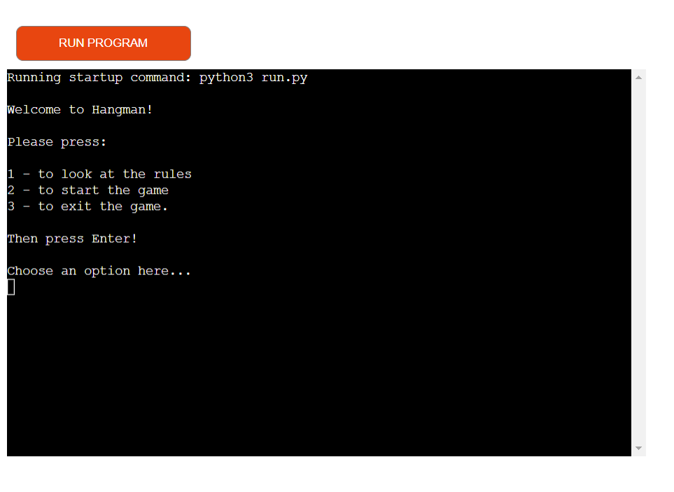

- If one of the correct options is not selected then the program will display a
message prompting the user to select either option one, two or three:

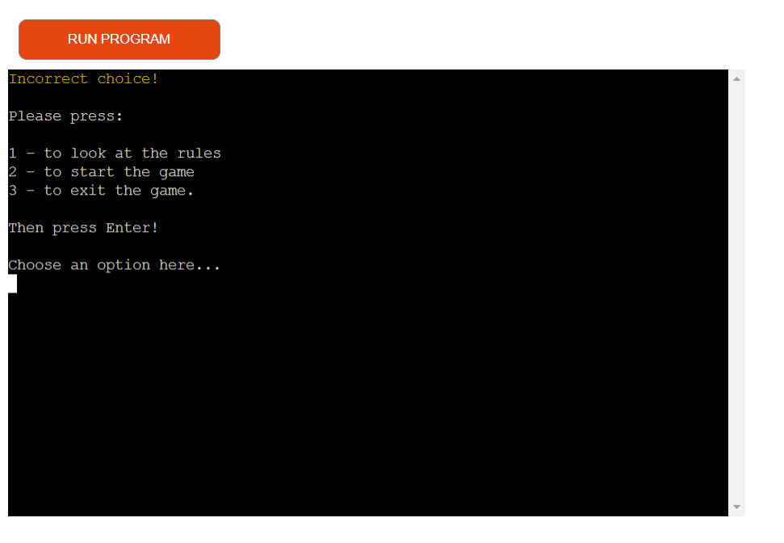

- If the user chooses to see the rules they will be taken to another page that
explains how you play the game. The user can then go back to the menu once they
have understood how to play:

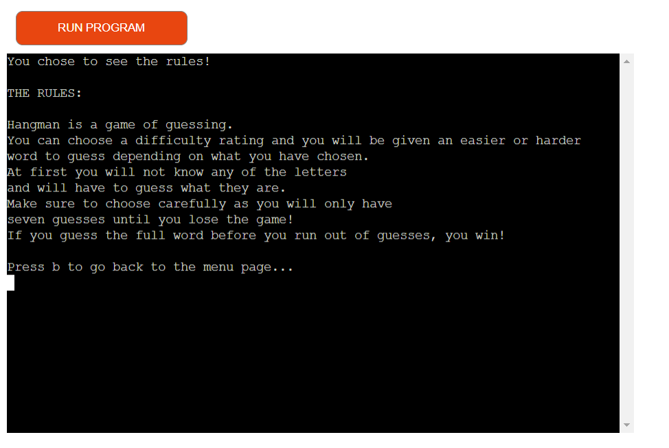

If the user hasn't selected the option to go back to the main menu a message
will be displayed prompting them to select the right one:

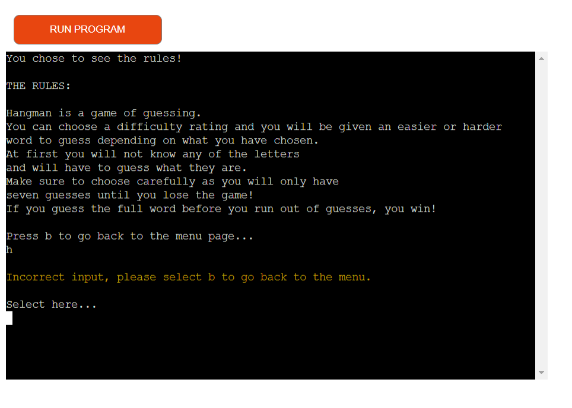

- If the user then selects the game option they will be brought to a screen
that requests which difficulty they would like to play with, out of either easy
medium or hard modes. The words will be shorter or longer and have more common
letters or less common depending on the difficulty:

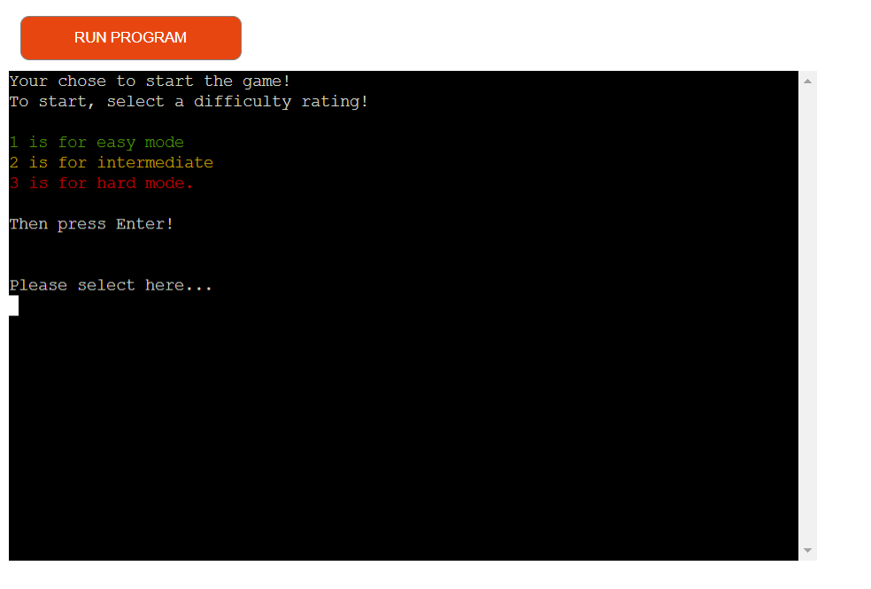

- If the user doesn't select one of the options displayed another message will
be shown giving them the correct options to choose from:

- Once the difficulty is chosen the user will be given the go-ahead to start
playing. Their word will also show now except all the letters will be replaced
with hyphons. They will be told their amount of lives in the same display also.

- The code is set up so the user can only select letters that are in the 
English alphabet along with only being able to pick one letter at a time which
means that pointless lives won't be wasted on selecting numbers and icons that
will not show in any words. The result is shown in green if the user guesses
correctly, in yellow if they have already guessed that letter, and in red
if they guessed an incorrect letter. This green yellow red theme is used
throughout the code for all affirmations and warnings and such.

- If the user guesses correctly, a message will show congratulating them and
if they lose it will show them a message informing them they lost. In both
results messages it will display the full word in green or red depending
on win or lose. The display show will also ask the user to return to the menu
page, which means they can either see the rules again to double-check that they
know them or play another game. If they do not want to do either they can of
course select the third option which is to exit the game. A display message
will show in green thanking them for playing hangman and the code will have
finished running. If they want to play again the user can just select the
'Run Program' button shown above the terminal.

## User Stories

### As a First-Time User:

- I would like to know the purpose of the program and what it does.

- I would like to be able to navigate around the game without any confusion of
where I am or where I should be going.

- I would like to have the game explained to me in a clear way that
I can understand.

- I would like to play a game that is inclusive of all beginner levels, as it
is my first time playing.

### As a Frequent Visitor:

- I would like to be able to know how to play a simple game comfortably without
the confusion that I may have had at first.

- I would like to play a game that continues to challenge me even if I play it
a lot more.

- I would like to play a game that you can play lots of times but still find
words I haven't seen in the game before.

## Deployment

1. To start with you would need to type this code into your IDE Terminal:

git clone https://github.com/AlistairDriscoll/project-3.git

2. Then create a GitHub repository to host the code and use this command to
link the remote repository location to this repository:

git remote set-url origin <Your GitHub Repo Path>

3. Lastly, push the files to the online repository using the push command:

git push

4. The app was then deployed onto a website called [Heroku](https://heroku.com/),
which specializes in application deployment for back-end languages
such as Python. To deploy, I needed to make an account on their website.
Once I had done this, I needed to press the 'new' button in the top right
corner of my account page and click 'create new app'.

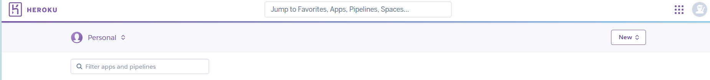

5. Following this, a page will come up asking what name you would like for
your app. Select a name that hasn't been chosen before then select your
region in the options section.

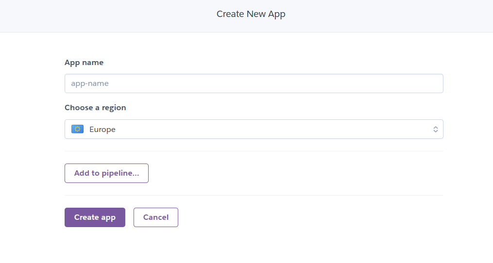

6. Next, go to the deploy section.

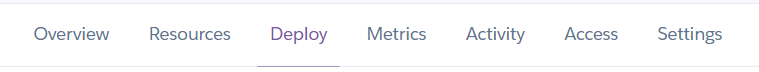

7. Now choose GitHub as your way of deploying.

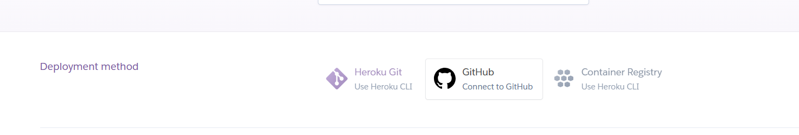

8. Underneath this, put in the repository you would like to connect to using
the form given.

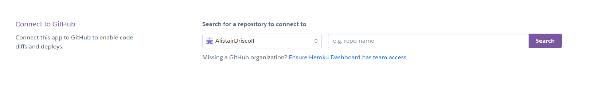

9. Now click on the settings button.

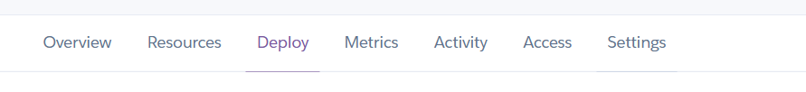

10. In the settings bit go to the Buildpacks section and select python,
then node.js. Please make sure they are ordered correctly, python should be
above node.js.

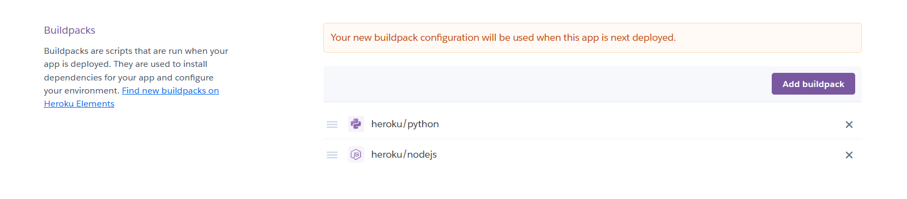

11. Then above the Buildpacks, there should be the Config Vars section.
Click the button to reveal the Config Vars and type in PORT in the key section
and 8000 in the value section.

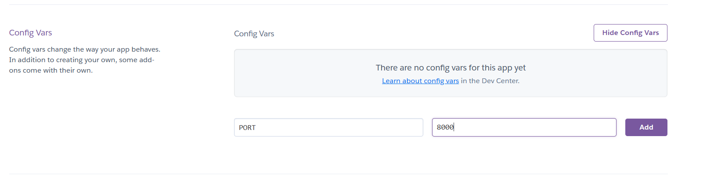

12. Now go back to the deployment and select the 'Deploy branch' button
at the bottom of the page.

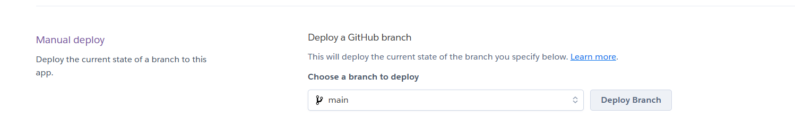

13. After a short while, once the website has done everything it needs to,
your app will be a live website! Simply click the open app button in the top
right corner to try it out!

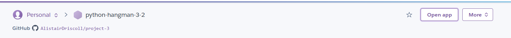

### Local Deployment

- The website can be accessed
with this [link](https://python-hangman-project-3-b49f3ebff2dd.herokuapp.com/)

- Or to deploy it to your IDE you can type this code into the terminal:
git clone https://github.com/AlistairDriscoll/project-3.git

Note: for the code to work you must have the latest version of
Python downloaded as well as Colorama. Download Python from the Python
website, install it then type this line of code into your terminal:

pip install colorama

## Design and Dependencies

- Packages used
- How I structured the code
- Separating packages
- Talk about words file
- Black used for formatting