# Project 3 - A Python Hangman Game

## To Play

- To start, click on
this [link](https://python-hangman-project-3-b49f3ebff2dd.herokuapp.com/)
or copy and paste this into your preferred browser:
https://python-hangman-project-3-b49f3ebff2dd.herokuapp.com/

- You can then as a user either look at the rules page or go straight to
playing hangman. You can choose to exit the game at this point also. Once you
start playing you keep putting letters in until you either guess the word or
run out of lives, your display will tell you at the end if you've won or lost
and you can return to the menu after this.

## Features

- The overall path of the game can be seen here, although with slight changes
by the time I finished the code.

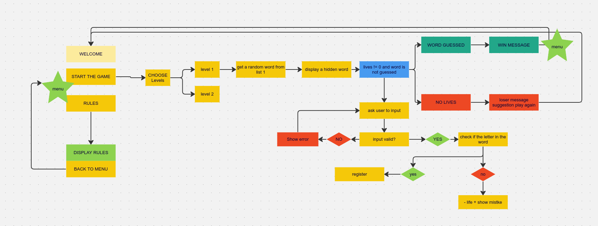

- The game's menu page is the first page the user will see. It comes with a
welcome message and a list of options showing where to go next:

- If one of the correct options is not selected then the program will display a
message prompting the user to select either option one, two or three:

- If the user chooses to see the rules they will be taken to another page that
explains how you play the game. The user can then go back to the menu once they
have understood how to play:

If the user hasn't selected the option to go back to the main menu a message
will be displayed prompting them to select the right one:

- If the user then selects the game option they will be brought to a screen
that requests which difficulty they would like to play with, out of either easy
medium or hard modes. The words will be shorter or longer and have more common
letters or less common depending on the difficulty:

- If the user doesn't select one of the options displayed another message will
be shown giving them the correct options to choose from:

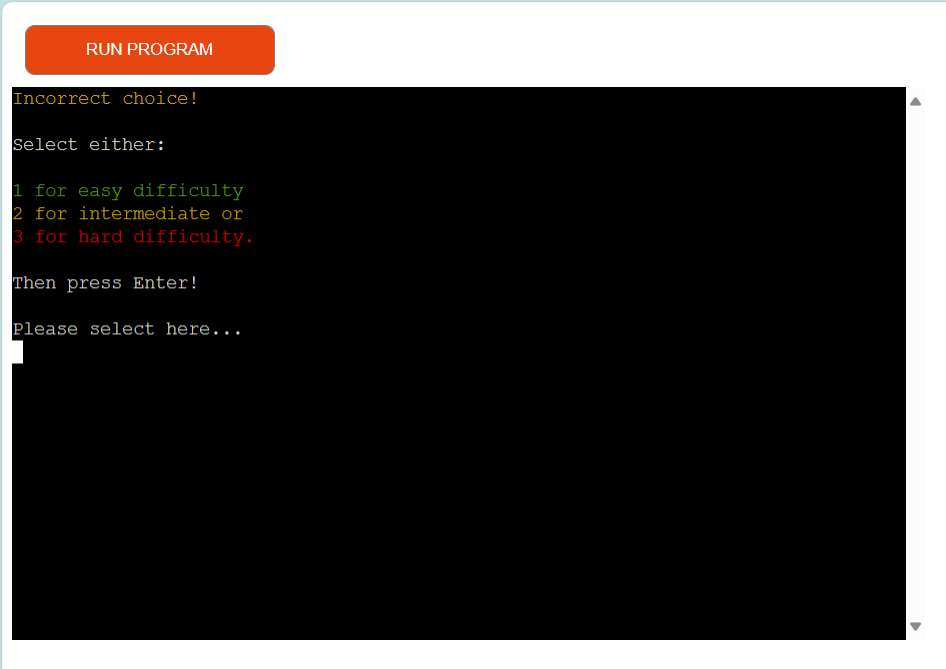

- Once the difficulty is chosen the user will be given the go-ahead to start
playing. Their word will also show now except all the letters will be replaced
with hyphons. They will be told their amount of lives in the same display and
the color of the difficulty word will reflect the difficulty selected:

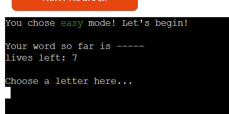

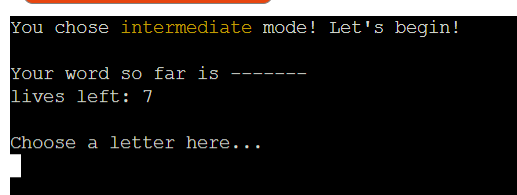

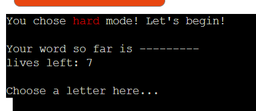

- The code is set up so the user can only select letters that are in the 
English alphabet along with only being able to pick one letter at a time which
means that pointless lives won't be wasted on selecting numbers and icons that
will not show in any words. The result is shown in green if the user guesses
correctly, in yellow if they have already guessed that letter, and in red
if they guessed an incorrect letter. This green yellow red theme is used
throughout the code for any affirmations or warnings.

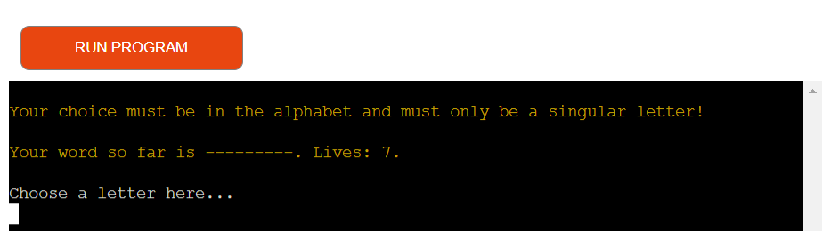

- If the user guesses correctly, a message will show congratulating them and
if they lose it will show them a message informing them they lost. In both
results messages it will display the full word in green or red depending
on win or lose. The display show will also ask the user to return to the menu
page, asking them to select the correct option if they select incorrectly
which means they can either see the rules again to double-check that they
know them or play another game. If they do not want to do either they can of
course select the third option which is to exit the game. A display message
will show in green thanking them for playing hangman and the code will have
finished running. If they want to play again the user can just select the
'Run Program' button shown above the terminal.

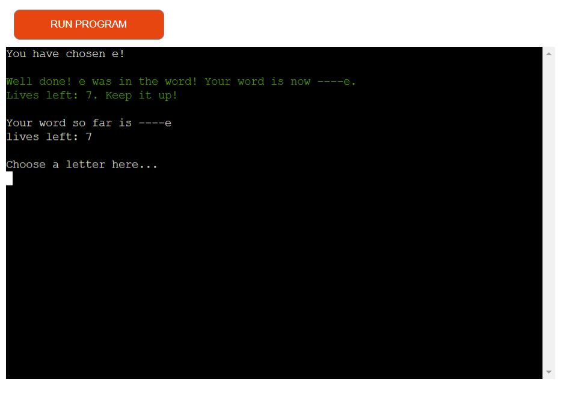

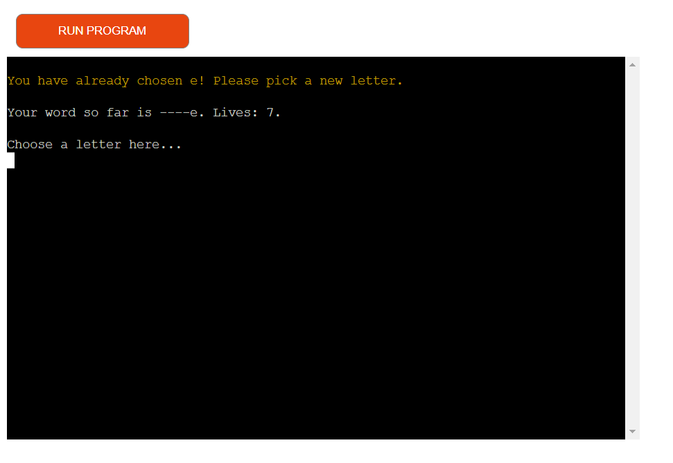

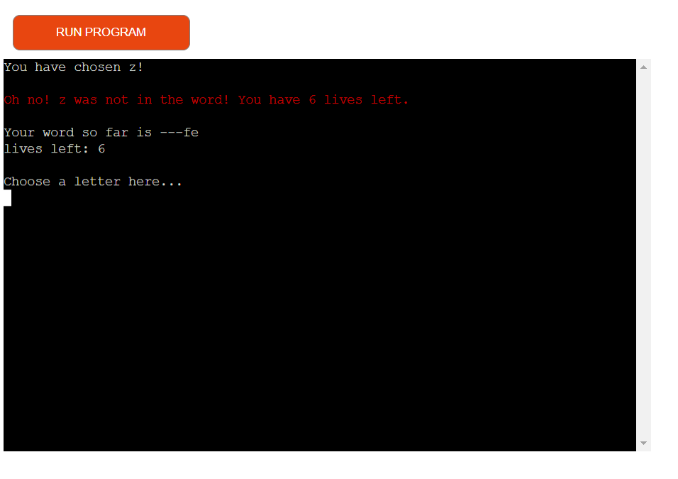

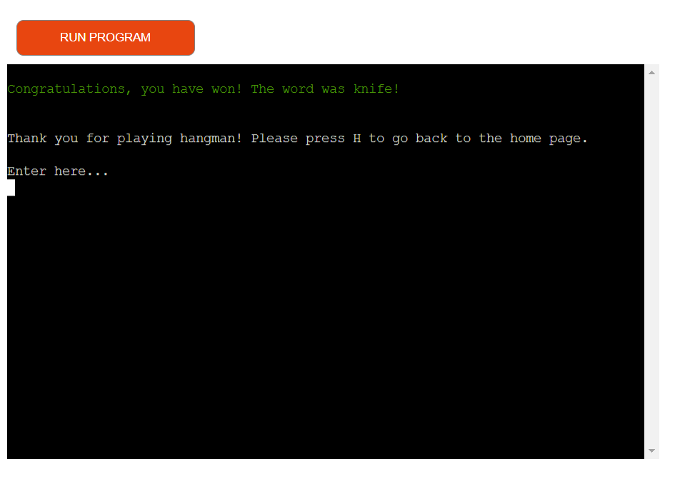

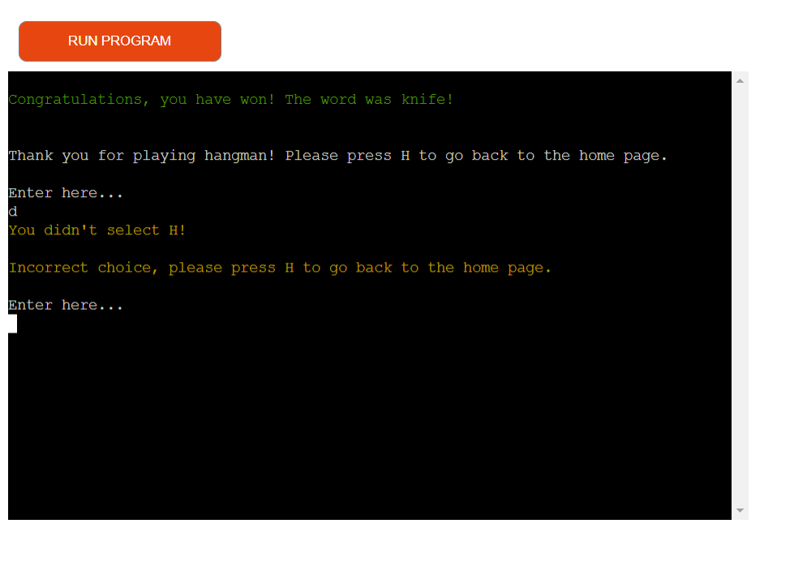

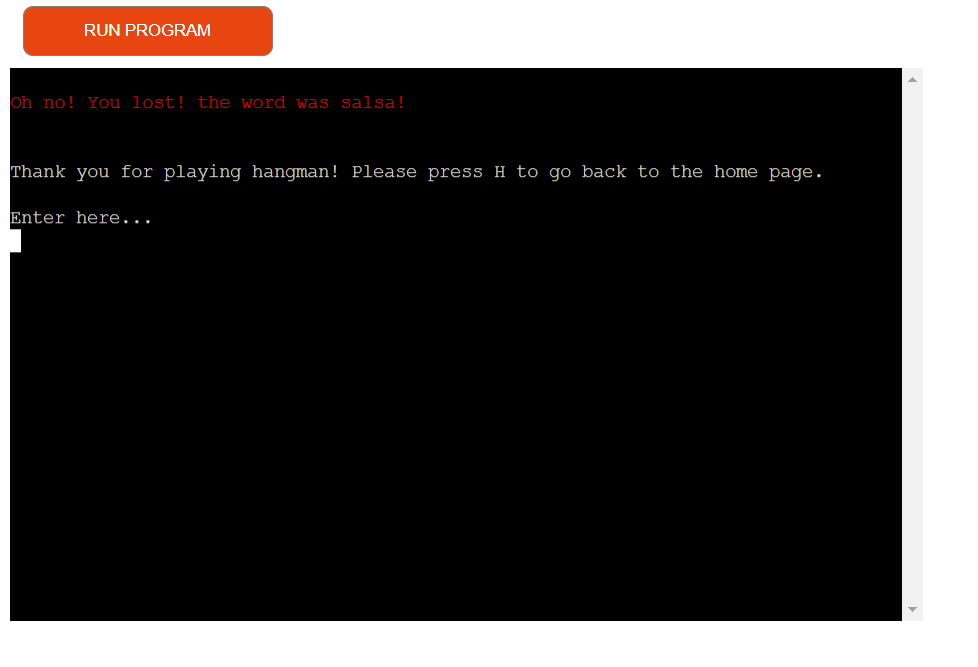

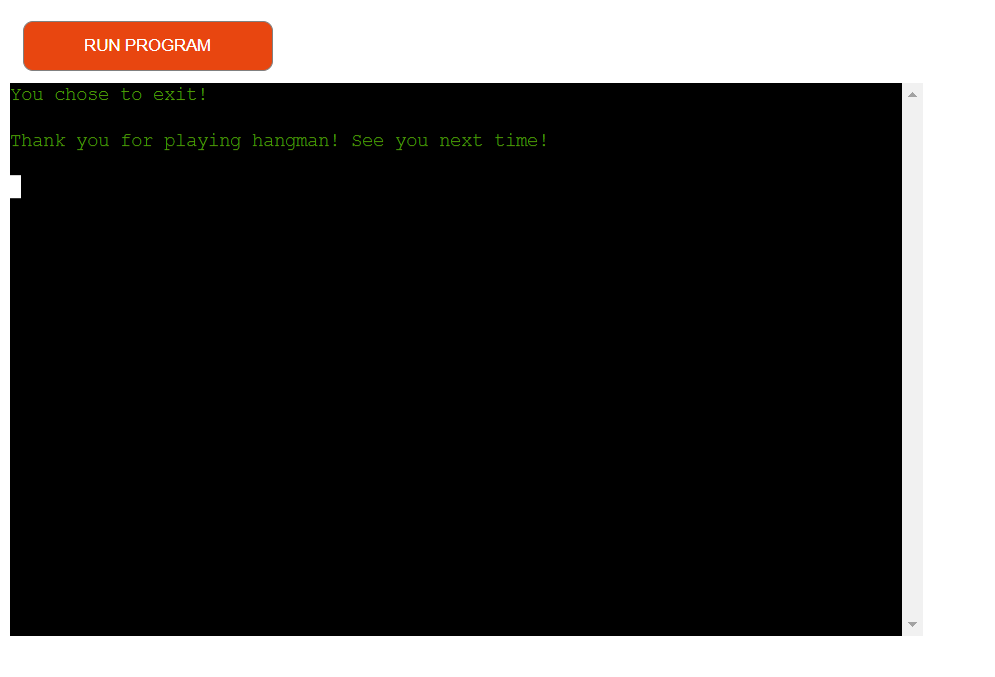

## User Stories

### As a First-Time User:

- I would like to know the purpose of the program and what it does.

- I would like to be able to navigate around the game without any mistaking of
where I am or where I should be going.

- I would like to have the game explained to me in a clear way that
I can understand.

- I would like to play a game that is inclusive of all beginner levels, as it
is my first time playing.

### As a Frequent Visitor:

- I would like to be able to know how to play a simple game comfortably without
the confusion that I may have had at first.

- I would like to play a game that continues to challenge me even if I play it
a lot more.

- I would like to play a game that you can play lots of times but still find
words I haven't seen in the game before.

## Deployment

1. To start with you would need to type this code into your IDE Terminal:

git clone https://github.com/AlistairDriscoll/project-3.git

2. Then create a GitHub repository to host the code and use this command to
link the remote repository location to this repository:

git remote set-url origin <Your GitHub Repo Path>

3. Lastly, push the files to the online repository using the push command:

git push

4. The app was then deployed onto a website called [Heroku](https://heroku.com/),
which specializes in application deployment for back-end languages
such as Python. To deploy, I needed to make an account on their website.
Once I had done this, I needed to press the 'new' button in the top right
corner of my account page and click 'create new app'.

5. Following this, a page will come up asking what name you would like for
your app. Select a name that hasn't been chosen before then select your
region in the options section.

6. Next, go to the deploy section.

7. Now choose GitHub as your way of deploying.

8. Underneath this, put in the repository you would like to connect to using
the form given.

9. Now click on the settings button.

10. In the settings bit go to the Buildpacks section and select python,
then node.js. Please make sure they are ordered correctly, python should be
above node.js.

11. Then above the Buildpacks, there should be the Config Vars section.
Click the button to reveal the Config Vars and type in PORT in the key section
and 8000 in the value section.

12. Now go back to the deployment and select the 'Deploy branch' button
at the bottom of the page.

13. After a short while, once the website has done everything it needs to,
your app will be a live website! Simply click the open app button in the top
right corner to try it out!

### Local Deployment

- The website can be accessed
with this [link](https://python-hangman-project-3-b49f3ebff2dd.herokuapp.com/)

- Or to deploy it to your IDE you can type this code into the terminal:
git clone https://github.com/AlistairDriscoll/project-3.git

Note: for the code to work you must have the latest version of
Python downloaded as well as Colorama. Download Python from the Python
website, install it then type this line of code into your terminal:

pip install colorama

## Technologies Used

### Main Technologies:

- Heroku as mentioned before was used for the deployment of the app.

- GitHub was used to store the project online and to send the code to Heroku.

- Visual Studio Code was used to type the project out,
test it and push the code to github.

- Python 3 was used for the main run.py file and to utilize all the other
technology in the project.

### Technology/Libraries Imported:

- Colorama was used to change the color of the text when needed.

- os was used to clear the terminal of previous messages and displays

- Random was used to be able to generate a random word out of the three lists
in the word file.

### Other Technologies:

- The Black Formatter extension was used for the formatting throughout the
Python files.

## Design:

There are eight functions in total, all written before the main function and
before any code to call them is written, meaning the computer will read through
all functions before any other code is written. Every other function stems
from the main function, which serves to call the main functions involved with
the game depending on what options the user chooses.
The imports are at the top of the file.

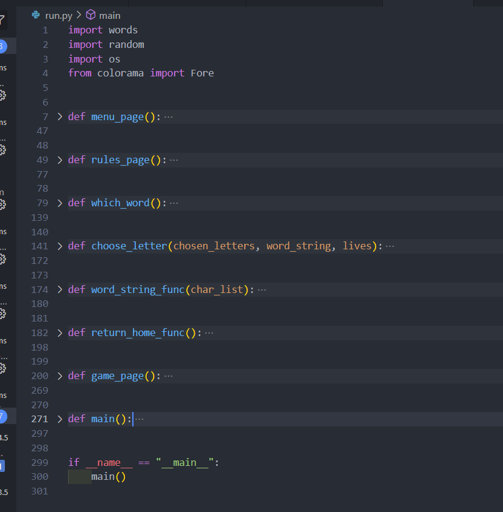

When the code starts running the main file is called. The first thing it does
is call the menu function. The while loop underneath then converts the users
input into an integer and skips the code within if the option is 3. The if
statement then executes based on if the input is either 1 or 2. Once the if
statement code has been executed the code asks again to run the menu_page
function, which ensures the main function and therefore the entire app will
keep running for as long as the user wishes.

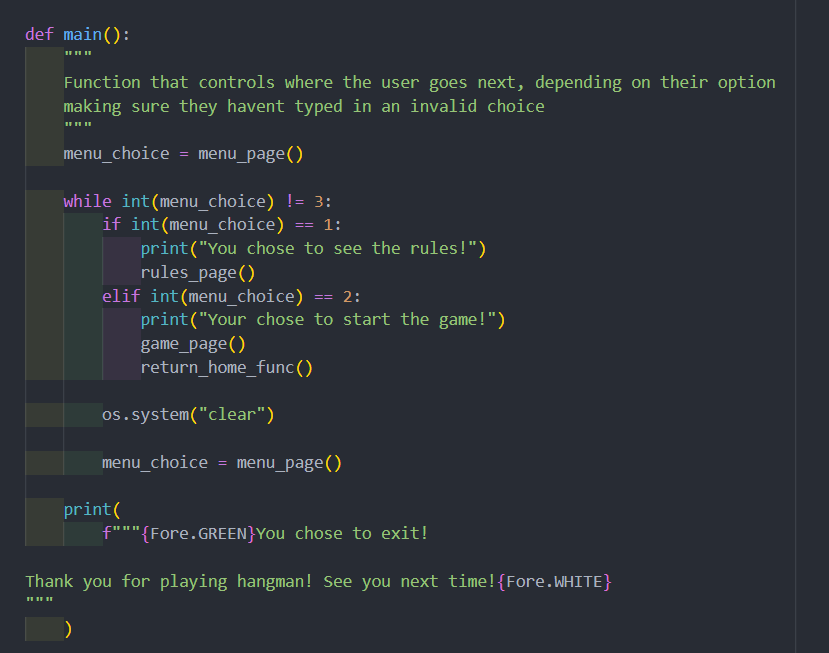

Once the menu function is called it has a while loop that makes sure
the user selects an option that is valid to keep the code running. Once it has
either 1, 2, or 3 from the user it will return what their choice was for the
main to convert to an integer in order to assess what to do with the input.
Everything is included in the screenshot below bar the comment which I couldn't
quite fit in the comment and I felt was redundant anyway as I am explaining how
the code works anyway in this section.

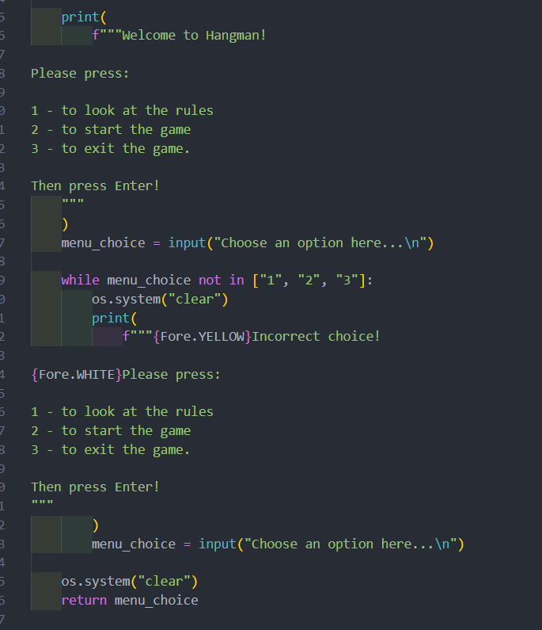

The rules function is also a simple one, it displays a message explaining the
rules of the game and asks the user to input the letter b to go back to the
menu page. The while loop converts the input to a capital meaning the input
choice will not be case-sensitive, making the app even easier to use. All
single-letter inputs have code on them in order for case sensitivity to not be
a problem.

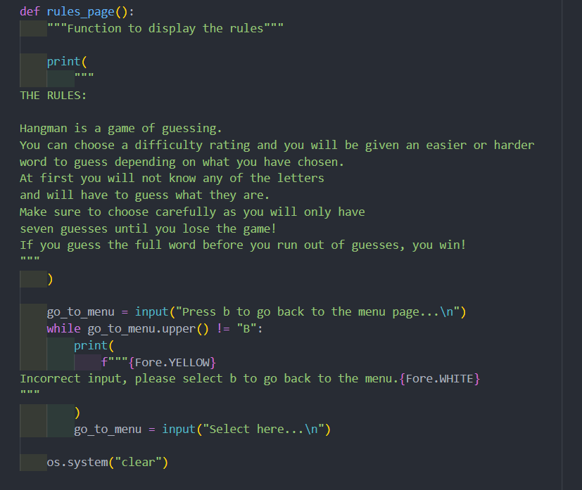

The game function is the main bread and butter of the app and the only
function apart from the main function to also call other functions. I thought
to put these smaller tasks as functions even though I could have maybe just had
a game section with loads of code but I felt it was a good idea to take small
tasks, complete them then get them out of the way, making the code look more
organized and easy to look at. I declared all the variables the function
would be using underneath the comments at the top as it would mean they would
start again off with the right values every time the game function is called.

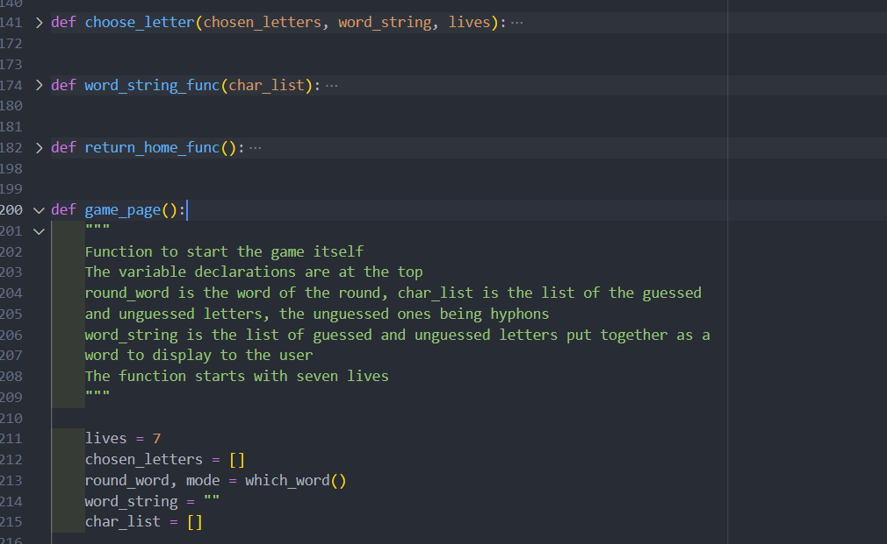

### Variables of the game function:

- The which_word function asks the user which difficulty they would like to play
the game on then picks a random word as the round_word from one of the three 
words.py files depending on what the user has picked.

- It then returns this word along with the mode the user chose to be used for 
the display message that follows.

- The chosen_letters list is the list of all the letters the user has guessed,
including both in the word and not in the word. Used so if a user accidentally
inputs something they have already chosen they will not lose another life for
it.

- The char_list is the list of the letters of the round_word both guessed and
unguessed, so it always starts with a hyphen per letter until the list items
get replaced with correctly guessed letters.

- The char_list had to be used as one cannot seem to tamper with the individual
letters of a string so the word_string is then made from this list by way of
the word_string_func that appends each character of the list into one string.

#### Top and bottom parts of the which_word function:

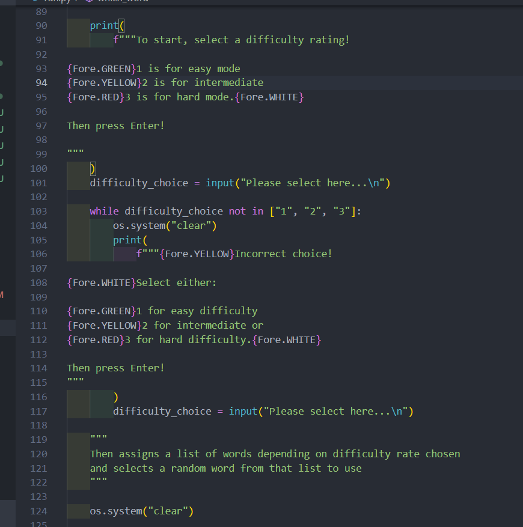

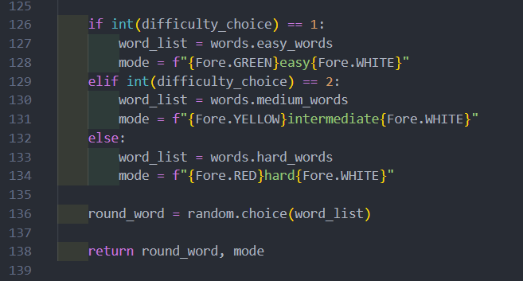

Code that displays the first game message and the start of the loop for while
there are more than 0 lives and still hyphens in the char_list, as this means
the game must keep prompting the user to input more letters:

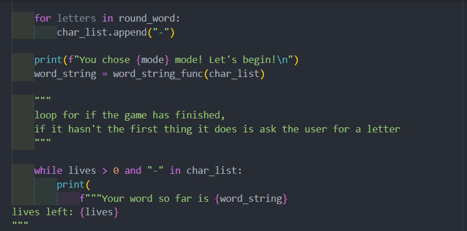

Then here the loop calls the function that asks for another letter, with
validation in that function, and checks to see if it is in the round_word. It
then displays the relevant message.

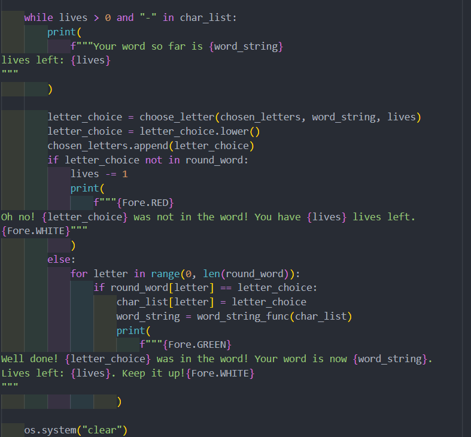

The choose_letter function:

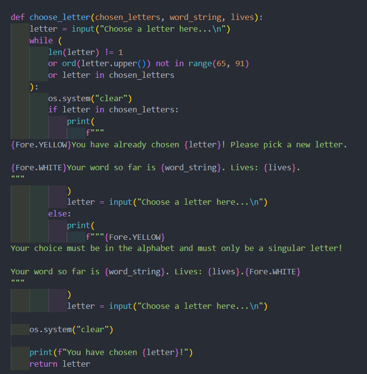

The while loop is finally ended if either there are no lives left or if there
are no hyphens left in the char_list. The program then runs a program to find
out which is true in order to display the right message.

After the game function has finished running, the return home function is
called, which requests the user to press h to go back to the home page.
Validation is in place so they can only choose that option and the user will
return to the main menu. The code can loop again if the user would like another
look at the rules or another game or they can choose to exit now also.

## Testing:

Testing can be found in the testing file with [this link](TESTING.md).

## Bugs

The bug that took the most time to solve was trying to be able to get the code
to repeat the game and rules functions as much as required. At first, I would
call the menu function before and after the rules function to make sure the
user could go back to the menu when they wanted to, but after the second time
it got called the code would just come to an end as it had all ran. I knew I
wanted to keep the idea of the user pressing 1 to go to the rules and 2 for the
actual game, and I already had the rules function that worked so didn't see
the point in trying something from scratch as from experience I'm
beginning to learn to keep my code and try and find a solution. My idea was
quite a happy accident as it meant my code would not be in an infinite loop
either. I chose to have an option 3 which doesn't actually do anything in the
while loop of the main function, instead, this option would skip the code and
finish off the main function. I then thought to add a goodbye message. This bug
took a lot of staring at the screen trying to figure something out,
experimenting and thinking about while going on a walk before I managed to
think outside the box for a solution. The bugs in this project and solutions
ended up changing the flow char that is further up in this file slightly by
adding new windows but I am still satisfied and think it's an improvement.

Another bug was when the user made a mistake, it may have been a 'yellow' kind
where they only picked a letter they had already chosen or had made a 'red'
mistake of getting it wrong, both error messages would show up instead of one.
I added a further if statement within the while loop at the top of the 
choose_letter function to solve this, improving the user experience.

## Credits

I have to thank several YouTube tutorials for helping me learn Colorama, and
I also have to thank my Code Institute mentor Julia for pushing me to learn
stuff that is out of the course content and driving me to be a better and more
detailed coder.