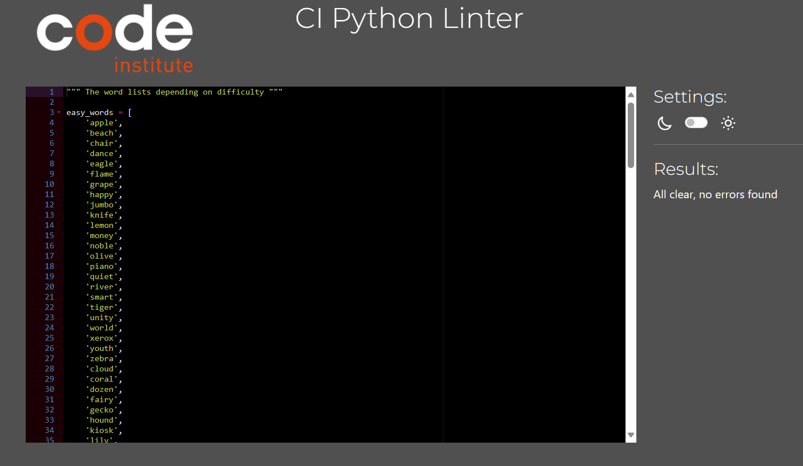

Click [Here](README.md) to go back to the README file.

The code was tested constantly for bugs and grammar during the development
process by friends and family by me sending them the link to the live website.

I also accidentally put the same word into two word lists which if the user
noticed may have thought to be counterintuitive, but those have since
been removed. 

The code was tested with this [link](https://pep8ci.herokuapp.com/) to see if
the code was Pep-8 compliant. Alternatively, you could copy and paste this into
your web browser to use it: https://pep8ci.herokuapp.com/

